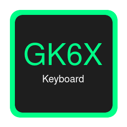

# GK6X Linux GUI - Configurador de Teclados Mecánicos



> Aplicación GUI moderna con AppImage para configurar teclados mecánicos GK6X (GK61, GK64, GK84, etc.) en Linux

## 🚀 Características

- ✅ **Interfaz Gráfica Moderna**: GUI oscura y intuitiva hecha con Python/Tkinter
- ✅ **AppImage Portátil**: Ejecutable único, no requiere instalación
- ✅ **Configuración Completa**: Mapeo de teclas, macros, capas y lighting
- ✅ **Editor Integrado**: Edita configuraciones directamente en la app
- ✅ **Web GUI Incluida**: Acceso a la interfaz web visual original
- ✅ **Consola en Tiempo Real**: Monitorea todas las operaciones
- ✅ **Multiplataforma**: Basado en el proyecto GK6X original

## 📦 Descargar

**[⬇️ Descargar GK6X-x86_64.AppImage](GK6X-x86_64.AppImage)** (48 MB)

```bash
# Dar permisos de ejecución
chmod +x GK6X-x86_64.AppImage

# Ejecutar
./GK6X-x86_64.AppImage
```

## 🎯 Teclados Compatibles

- GK61 / SK61
- GK64 / GK64S
- GK68XS
- GK84
- Y otros teclados con chip GK6X

## 📖 Uso Rápido

1. **Conecta tu teclado GK6X**
2. **Ejecuta el AppImage**:
   ```bash
   ./GK6X-x86_64.AppImage
   ```
3. **El dispositivo se detecta automáticamente**
4. **Usa las acciones rápidas**:
   - 📝 **Aplicar Configuración**: Mapea tu config personalizada
   - 🔄 **Reset**: Vuelve a configuración de fábrica
   - 📋 **Listar Teclas**: Muestra todas las teclas disponibles
   - 🔍 **Identificar Teclas**: Encuentra nombres de teclas

## 🔐 Permisos USB (Importante)

Para usar sin `sudo`, configura reglas udev:

```bash
# 1. Crear archivo de reglas
sudo nano /etc/udev/rules.d/99-gk6x.rules

# 2. Agregar estas líneas:
SUBSYSTEM=="input", GROUP="input", MODE="0666"
SUBSYSTEM=="usb", ATTRS{idVendor}=="1ea7", ATTRS{idProduct}=="0907", MODE:="666", GROUP="plugdev"
KERNEL=="hidraw*", ATTRS{idVendor}=="1ea7", ATTRS{idProduct}=="0907", MODE="0666", GROUP="plugdev"

# 3. Agregar usuario al grupo plugdev
sudo usermod -a -G plugdev $USER

# 4. Recargar reglas
sudo udevadm control --reload-rules
sudo udevadm trigger

# 5. Reiniciar o reconectar el teclado
```

## 🔧 Compilar desde el Código Fuente

### Requisitos

```bash
# Fedora/RHEL
sudo dnf install python3 wget unzip imagemagick

# Opcional (para compilar GK6X desde fuente):
sudo dnf install mono-complete

# Ubuntu/Debian
sudo apt install python3 wget unzip imagemagick mono-complete
```

### Compilación

```bash
# Clonar el repositorio
git clone https://github.com/vargasjosej/gk6x.git
cd gk6x

# Ejecutar script de compilación
./build_appimage.sh

# El AppImage se generará como: GK6X-x86_64.AppImage
```

## 📝 Ejemplo de Configuración

```bash
# Archivo de configuración: UserData/tu_modelo.txt

# Mapeo básico
A=B                    # Tecla A ahora escribe B
Esc=CapsLock          # Esc actúa como Caps Lock

# Macros
F1={LControl,C}        # F1 = Ctrl+C
F2={LControl,V}        # F2 = Ctrl+V
F3={LControl,LAlt,T}   # F3 = Ctrl+Alt+T (abrir terminal)

# Capas (Layers)
[Layer1]
A=Up
S=Down
D=Left
F=Right

[Layer2]
1=F1
2=F2
3=F3
```

## 🖥️ Capturas de Pantalla

La aplicación incluye:
- **Pestaña de Acciones Rápidas**: Botones para operaciones comunes
- **Editor de Configuración**: Edita configs con resaltado de sintaxis
- **Consola**: Output en tiempo real de todas las operaciones
- **Web GUI**: Interfaz visual para configuración gráfica

## 🛠️ Características Técnicas

- **Frontend**: Python 3 + Tkinter
- **Backend**: C# con Mono Runtime
- **Empaquetado**: AppImage (portable)
- **Tamaño**: ~48 MB
- **Dependencias**: Python3, Mono (incluido o del sistema)

## 📚 Documentación

- [README AppImage](README_APPIMAGE.md) - Guía completa de uso
- [BUILDING.md](BUILDING.md) - Guía de compilación detallada
- [Proyecto Original GK6X](https://github.com/pixeltris/GK6X)

## 🐛 Resolución de Problemas

### El dispositivo no se detecta

```bash
# Verificar conexión USB
lsusb | grep 1ea7

# Verificar permisos HID
ls -l /dev/hidraw*

# Ejecutar con sudo (temporal)
sudo ./GK6X-x86_64.AppImage
```

### Mono no está instalado

```bash
# Fedora
sudo dnf install mono-core mono-devel

# Ubuntu
sudo apt install mono-runtime
```

### La GUI no abre

```bash
# Verificar Python
python3 --version

# Ejecutar con debug
./GK6X-x86_64.AppImage --appimage-debug
```

## 🤝 Contribuir

¡Las contribuciones son bienvenidas!

1. Fork el proyecto
2. Crea tu rama de feature (`git checkout -b feature/AmazingFeature`)
3. Commit tus cambios (`git commit -m 'Add AmazingFeature'`)
4. Push a la rama (`git push origin feature/AmazingFeature`)
5. Abre un Pull Request

## 📄 Licencia

Este proyecto está bajo la Licencia MIT - ver [LICENSE](LICENSE) para detalles.

Proyecto original GK6X por [pixeltris](https://github.com/pixeltris/GK6X) - MIT License

## 🙏 Agradecimientos

- [pixeltris/GK6X](https://github.com/pixeltris/GK6X) - Proyecto original y backend
- [wgwoods/gk64-python](https://github.com/wgwoods/gk64-python) - Ingeniería inversa del firmware
- Comunidad de AppImage
- Comunidad de teclados mecánicos

## 🔗 Enlaces

- **Issues**: [GitHub Issues](https://github.com/vargasjosej/gk6x/issues)
- **Proyecto Original**: [pixeltris/GK6X](https://github.com/pixeltris/GK6X)
- **AppImage**: [appimage.org](https://appimage.org/)

---

**Hecho con ❤️ para la comunidad de teclados mecánicos Linux**

*¿Te gusta el proyecto? Dale una ⭐ en GitHub!*
